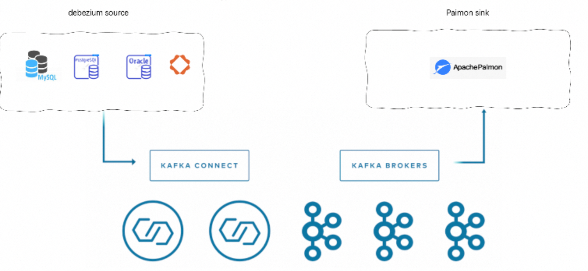

# Apache Paimon Kafka Connect Connector

This repository is Kafka Connect Connector for the [Apache Paimon](https://paimon.apache.org/) project.

## Architecture


## Configurations

### Options 

| Name                           | Type    | require | default                                    | description                                                                                                                                                                     |
|--------------------------------|---------|---------|--------------------------------------------|---------------------------------------------------------------------------------------------------------------------------------------------------------------------------------|
| tasks.max                      | int     | no      | 1                                          | The concurrent number cannot exceed the number of topic partitions                                                                                                              |
| connector.class                | string  | yes     | io.connect.paimon.sink.PaimonSinkConnector | Fixed value                                                                                                                                                                     |
| topics                         | string  | yes     | -                                          | Topic for capturing data, multiple separated by commas                                                                                                                          |
| table.name.format              | string  | yes     | -                                          | A format string for the table, which may contain '${topic}' as a placeholder for the original topic name.For example: ${source.table}                                           |
| database.name.format           | string  | yes     | -                                          | A format string for the database, which may contain '${topic}' as a placeholder for the original topic name. For example: ${source.db}                                          |
| auto.create                    | boolean | no      | false                                      | Enabled auto create table.                                                                                                                                                      |
| auto.evolve                    | boolean | no      | false                                      | Enabled schema evolution.                                                                                                                                                       |
| case.sensitive                 | boolean | no      | true                                       | -                                                                                                                                                                               |
| table.config.*                 | string  | no      | -                                          | Paimon table config option, use prefix 'table.config.' to set, Refrence: [CoreOptions](https://paimon.apache.org/docs/master/maintenance/configurations/#coreoptions)           |
| catalog.config.*               | string  | no      | -                                          | Paimon catalog config option, use prefix 'catalog.config.' to set, Refrence: [CatalogOptions](https://paimon.apache.org/docs/master/maintenance/configurations/#catalogoptions) |
| table.default-primary-keys     | string  | no      | -                                          | Configure primary keys, multiple separated by commas.                                                                                                                           |
| table.default-partition-keys   | string  | no      | -                                          | Configure partition keys,  multiple separated by commas.                                                                                                                        |
| enabled.orphan.files.clean     | boolean | no      | false                                      | Enabled orphan files clean.                                                                                                                                                     |
| orphan.files.clean.interval-ms | int     | no      | 1000 * 60 * 60                             | -                                                                                                                                                                               |
| orphan.files.clean.older-than  |         | no      | 1 days                                     | -                                                                                                                                                                               |
| orphan.files.clean.parallelism | int     | no      | 1                                          | -                                                                                                                                                                               |
| orphan.files.clean.database    |         | no      | -                                          | Configure databases that require orphan file cleanup                                                                                                                            |

### How to config

[Example](src%2Fmain%2Fresources%2Fexample-fixed-bucket.json)

## How to Compile

### Prepare

Before we start talking about how to set up the environment, we need to do some preparation work. Make sure you already
have installed the following software:

* [Git](https://git-scm.com/book/en/v2/Getting-Started-Installing-Git) installed.
* [Java](https://www.java.com/en/download/) ( JDK8/JDK11 are supported by now) 
* [JetBrains IDEA](https://www.jetbrains.com/idea/) installed.

### Code Style

```shell
mvn spotless:apply
```

### Compile

```shell
mvn clean package -Dmaven.test.skip=true
```

### How to run

* [kafka_connect_local_deployment_doc](deploy%2Fkafka_connect_local_deployment_doc.md)
* [kafka_connect_docker_deployment_doc](deploy%2Fkafka_connect_docker_deployment_doc.md)


## License

[Apache 2.0 License](LICENSE)